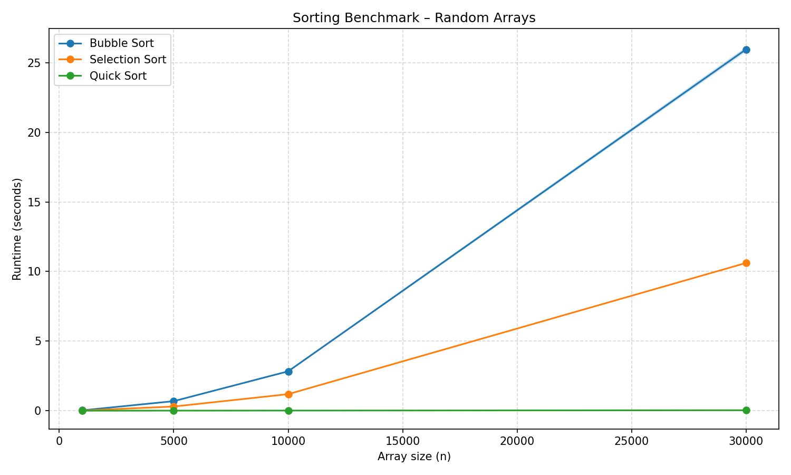
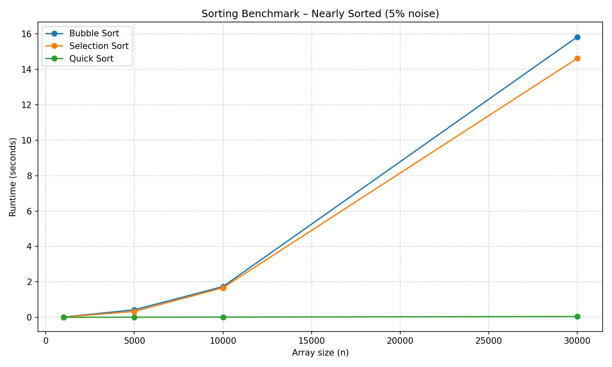

# Sorting Algorithms – Benchmarking Assignment

**Student Names:** Tomer Bachar, 322884974 / Hile Husni, 206405201


## Selected Algorithms
| ID | Algorithm      | Worst Case   | Average Case  | Best Case |
|----|----------------|-------------|---------------|-----------|
| 1  | Bubble Sort    | O(N²)       | O(N²)        | O(N)      |
| 2  | Selection Sort | O(N²)       | O(N²)        | O(N²)     |
| 5  | Quick Sort     | O(N²)       | O(N log N)   | O(N log N)|


## How to Run
```bash
# Part B – random arrays example
python3 run_experiments.py -a 1 2 5 -s 100 500 1000 3000 -r 20

# Part C – nearly sorted exaple, 5% noise
python3 run_experiments.py -a 1 2 5 -s 100 500 1000 3000 -e 1 -r 20

# Part C – nearly sorted example, 20% noise
python3 run_experiments.py -a 1 2 5 -s 100 500 1000 3000 -e 2 -r 20
```


## Dependencies
```bash
python3 -m pip install numpy matplotlib
```


## Part B – Random Array Results
**Theoretical expectations:**
* Bubble Sort and Selection Sort are both O(N²) algorithms. Their runtime should grow quadratically with the input size — doubling N roughly quadruples the execution time. In the plot, both curves exhibit this steep, parabolic growth pattern.
* Quick Sort has an average-case complexity of O(N log N), which grows much more slowly.


**Empirical observations:**
* At small sizes (N ≤ 500), all three algorithms finish almost instantly and the differences are negligible.
* As N grows toward 3 000, the O(N²) algorithms diverge sharply from Quick Sort. Bubble Sort is typically the slowest because each element may be swapped many times (one position per pass), while Selection Sort performs fewer swaps (exactly N) but the same number of comparisons.
* Quick Sort's runtime remains low throughout, confirming its O(N log N) average behaviour. The randomised pivot selection prevents worst-case degradation on these random inputs.


## Part C – Nearly Sorted Array Results
**Key observations compared to random arrays:**

* Bubble Sort benefits the most from nearly-sorted input. Its early-exit optimisation (`swapped` flag) allows it to terminate a pass as soon as no swaps occur. On a 5 %-noise array, the vast majority of elements are already in place, so Bubble Sort finishes in far fewer passes than on random data — approaching its O(N) best case. Even at 20 % noise the improvement is significant.
* Selection Sort shows little to no improvement. It always scans the entire unsorted portion to find the minimum, regardless of the input's existing order. Its comparison count remains O(N²) whether the array is sorted, nearly sorted, or random. This is visible in the plot: its curve barely changes between Part B and Part C.
* Quick Sort remains fast but does not gain as much relative advantage as Bubble Sort on nearly-sorted data (it was already fast). The randomised pivot ensures it avoids the O(N²) worst case that a deterministic pivot (e.g., always choosing the first element) would produce on sorted or nearly-sorted input.


**Why does Bubble Sort improve on nearly-sorted data?**

Bubble Sort's inner loop only swaps adjacent elements that are out of order. When most elements are already sorted, very few swaps occur per pass. The `swapped` flag detects a clean pass and exits immediately, reducing the number of passes from N down to roughly the number of displaced elements. This makes Bubble Sort adaptive — its performance depends on the disorder (number of inversions) in the input, not just the input size.
